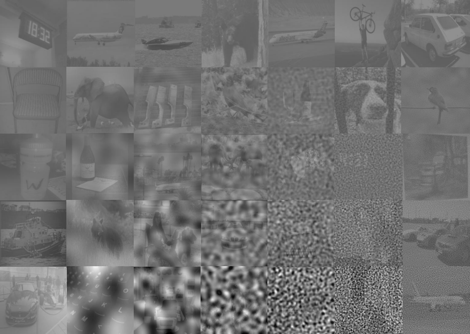

# Code for *Spatial-frequency channels, shape bias, and adversarial robustness*

This repository contains code and files required to generate critical band masking images and reproduce experiments from our ***NeurIPS 2023 (Oral) paper: "Spatial-frequency channels, shape bias, and adversarial robustness"***. You can find the paper here: https://arxiv.org/abs/2309.13190.



## 0. Installation
First, clone the repository and install the required python packages into a Conda environment.

```
# Clone
git clone https://github.com/ajaysub110/critical-band-masking

# Create conda environment
conda create -n cbm_env --python=3.8 pip

# Install requirements
cd critical-band-masking
pip install -r requirements.txt
```

## 1. Generating image dataset
For all our critical-band masking experiments on humans and machines, we use a dataset of low-contrast, grayscale ImageNet (*Russakovsky et al., 2015*) images perturbed with Gaussian noise of 5 possible strengths, bandpass-filtered within 7 possible octave-wide spatial-frequency bands. Filtering code uses [pyrtools](https://github.com/LabForComputationalVision/pyrtools) (*Broderick et al., 2019*).

You can download the critical-band masking image dataset we used for all human and neural network experiments [here](https://drive.google.com/file/d/1Z5HSjYmVBXTx0_G07mrgeLpJj0PYJh4B/view?usp=sharing). Extract the zip file and save it in the `stimuli/` folder.

Otherwise, as shown below you can use scripts in the `stimuli/` folder also generate your own *critical-band masking* image dataset from a dataset of grayscale images in the same directory format as GraySplit.

**NOTE: If you intend to reproduce results exactly from the paper, please use the version of CBMSplit in the provided link. It used a different random seed.**

### A. Download GraySplit
GraySplit is a dataset of 1100 grayscale-converted ImageNet images that we created from the original ImageNet validation dataset. These images are divided into 6 splits, named `train`, `0`, `1`, `2`, `3`, `4`, and `5`. `0`-`5` contain 210 images each, and `train` contains 50, making up a total of 1100 images.

Image files within each split are named according to the following convention: `<index>_color_gray_g_<category>.JPEG`, where `<index>` refers to the image's index within the split, and `<category>` is the object category the image belongs to. As mentioned in the paper, we use categories from 16-class ImageNet (*Geirhos et al., 2018*) - airplane, bear, bicycle, bird, boat, bottle, car, cat, chair, clock, dog, elephant, keyboard, knife, oven, truck. Each split in GraySplit has a more-or-less equal number of images from each of these categories.

GraySplit forms a source image set for all of our critical band masking experiments in the paper. It can easily be generated from the ImageNet validation set, but we provide a link to GraySplit because its much smaller and more convenient to use as it has been split and sorted by category for you. We apply all of the filtered-noise transformations in the next section to images in GraySplit. The `train` subdirectory will become the training images (for humans), and the numbered subdirectories, the test images for both humans and networks.

Download GraySplit.zip from [here](https://drive.google.com/file/d/160feWmVJMgKaIAwmNxnTrhQ3NvhcgJT0/view?usp=sharing) and unzip it to the `stimuli/` directory.

### B. Generate critical-band masking (CBM) dataset
Now, you can generate our critical-band masking dataset by simple running the `stimuli/createCBMDataset.py` providing the path to the 16-class ImageNet directory and output directory as arguments.

```
python stimuli/createCBMDataset.py
```
The output directory will be organized as follows
```
outputDirectory
- 0
	... (210 images)
- 1
	... (210 images)
- 2
	... (210 images)
- 3
	... (210 images)
- 4
	... (210 images)
- train
	... (50 images)
```
All image filenames are formatted as `<index>_cbm_noise<noise_sd>_freq<freq_index>_gray_g_<category>.JPEG`, where `<noise_sd>` is the strength of added noise, and `<freq_index>` is its spatial-frequency. The train folder was used to train human observers in our psychophysics experiments, and was not used for neural network evaluation.

## 2. Human psychophysics dataset and analysis
The data from our human psychophysics experiment (data), are available in `data/human_data.txt`. It's in an uncommonly used format, so we provide a demo analysis in the iPython notebook `humans/human_analysis.ipynb`, where we load the data, compute accuracy heatmaps, thresholds and find the human channel.

## 3. Neural network evaluation
Finally, we provide code to evaluate neural network models on the critical-band masking task (`nn_cbm.py`), and also to compute their shape bias (`nn_shapebias.py`) and adversarial robustness (`nn_whitebox.py`).

## References
1. Russakovsky, O., Deng, J., Su, H., Krause, J., Satheesh, S., Ma, S., ... & Fei-Fei, L. (2015). Imagenet large scale visual recognition challenge. International journal of computer vision, 115, 211-252.
2. Geirhos, R., Temme, C. R., Rauber, J., Schütt, H. H., Bethge, M., & Wichmann, F. A. (2018). Generalisation in humans and deep neural networks. Advances in neural information processing systems, 31.
3. William Broderick, Pierre-Étienne Fiquet, Zhuo Wang, Zahra Kadkhodaie, Nikhil Parthasarathy, and the Lab for Computational Vision (2019)